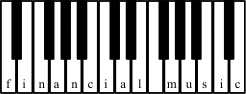

# Financial Music
Please read the dissertation in PDF form [here](http://heliomass.com/financial-music).

This repository contains source code, test accounts, produced music and *LaTeX* source for my undergraduate university dissertation, circa 2008.

## Abstract

In Douglas Adams' novel "Dirk Gently's Holistic Detective Agency", he describes software capable of generating music from corporate accounts. The music generated was capable of conveying the state of an account, to the point where a listener was able to make an investment decision.

Over the course of this dissertation, we will design, develop, implement and evaluate two approaches towards achieving this. We will focus on both conveying the account's nature, and on making the audio output as musical as possible. The first approach explored is a mathematical approach in which we generate 'signals' from the accounts. These signals are used to appropriate musical sequences. The second approach uses L-Systems to generate music from these same signals.

We will discover in the evaluation that both approaches produce audio output which is considered musical. We will also discover that the L-System approach shows the highest level of success when conveying the nature of an account.

Finally, we will go forward to design a novel idea called The Financial Genome, in which we attempt to use a biologically inspired approach to identify patterns in accounts, find an optimum genome.
